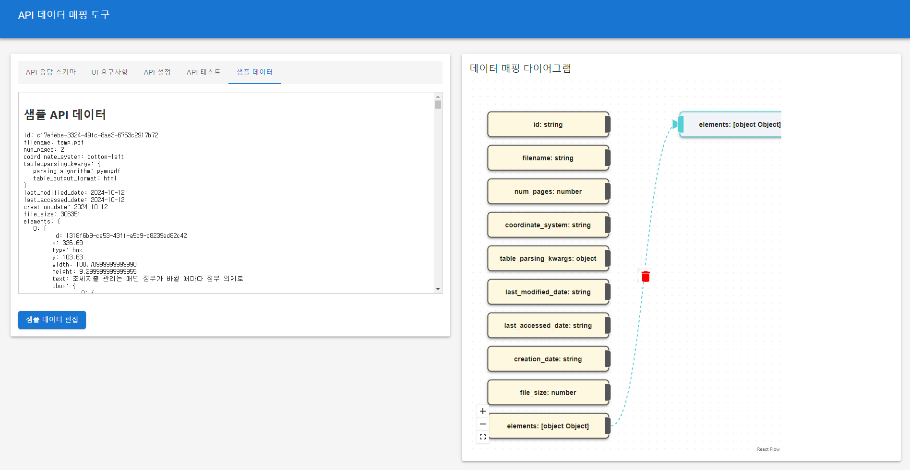

# 데이터 매핑 에디터

## 소개
데이터 매핑 에디터는 API 응답 데이터를 UI 요구 스키마에 맞게 변환하는 강력한 도구입니다. 이 애플리케이션은 개발자와 데이터 엔지니어가 복잡한 데이터 구조를 쉽게 변환할 수 있도록 도와줍니다.



## 주요 기능
1. API 스키마 편집
2. UI 스키마 확인
3. 직관적인 필드 매핑
4. 사용자 정의 변환 함수 작성
5. 실시간 결과 미리보기
6. API 테스트 기능

## 설치 및 실행

### 요구사항
- Node.js (v14 이상)
- npm (v6 이상)
- Docker 및 Docker Compose (선택적)

### 로컬 설치 및 실행
1. 저장소를 클론합니다:
   ```
   git clone https://github.com/sungreong/DataMappingWizard.git
   ```
2. 프로젝트 디렉토리로 이동합니다:
   ```
   cd DataMappingWizard
   ```
3. 필요한 패키지를 설치합니다:
   ```
   npm install
   ```
4. 개발 서버를 시작합니다:
   ```
   npm start
   ```
5. 브라우저에서 `http://localhost:1234`로 접속하여 애플리케이션을 사용합니다.

### Docker Compose를 사용한 실행
1. 저장소를 클론합니다:
   ```
   git clone https://github.com/sungreong/DataMappingWizard.git
   ```
2. 프로젝트 디렉토리로 이동합니다:
   ```
   cd DataMappingWizard
   ```
3. Docker Compose를 사용하여 애플리케이션을 빌드하고 실행합니다:
   ```
   docker-compose up --build
   ```
4. 브라우저에서 `http://localhost:1234`로 접속하여 애플리케이션을 사용합니다.

5. 애플리케이션을 중지하려면 다음 명령어를 실행합니다:
   ```
   docker-compose down
   ```

## 사용 방법

### 1. API 스키마 편집
- '스키마 편집' 버튼을 클릭하여 API 응답 스키마를 수정합니다.
- JSON 형식으로 스키마를 입력합니다.
- 주의: 스키마 변경 시 기존 매핑과 변환 함수가 초기화됩니다.

### 2. UI 스키마 확인
- UI 요구 스키마는 미리 정의되어 있으며, 오른쪽 패널에서 확인할 수 있습니다.

### 3. 필드 매핑
- 중앙의 FlowDiagram을 사용하여 API 필드와 UI 필드를 연결합니다.
- 마우스로 드래그하여 선을 그어 매핑을 생성합니다.
- 매핑 선의 삭제 아이콘을 클릭하여 매핑을 제거할 수 있습니다.

### 4. 변환 함수 작성
- 매핑된 필드에 대해 하단의 MonacoEditor를 사용하여 JavaScript 변환 함수를 작성합니다.
- 입력과 출력 타입이 주석으로 제공되어 함수 작성을 돕습니다.

### 5. 결과 미리보기
- '변환 실행' 버튼을 클릭하여 현재 매핑과 변환 함수를 적용한 결과를 미리봅니다.
- 오류가 있는 경우 화면 하단에 스낵바로 알림이 표시됩니다.

### 6. API 테스트
- API 테스트 섹션에서 실제 API를 호출하여 결과를 확인할 수 있습니다.
- 파일 업로드 및 다양한 파라미터 설정이 가능합니다.
- API 호출 결과는 스크롤 가능한 영역에 표시되며, 복사 기능을 제공합니다.

## 주의사항
- 모든 UI 필드는 반드시 매핑되어야 합니다.
- 변환 함수는 올바른 JavaScript 문법으로 작성해야 합니다.
- 출력 데이터는 UI 스키마와 정확히 일치해야 합니다.

## 문제 해결
- 실행 중 문제가 발생하면 브라우저 콘솔 로그를 확인하세요.
- 패키지 관련 문제는 `npm install`을 다시 실행하여 해결할 수 있습니다.
- Docker 관련 문제는 Docker 로그를 확인하고 필요한 경우 이미지를 재빌드하세요.

## 기여
프로젝트 개선에 기여하고 싶으시다면 Pull Request를 보내주세요. 모든 기여를 환영합니다!

## 라이선스
이 프로젝트는 MIT 라이선스 하에 배포됩니다. 자세한 내용은 [LICENSE](LICENSE) 파일을 참조하세요.
